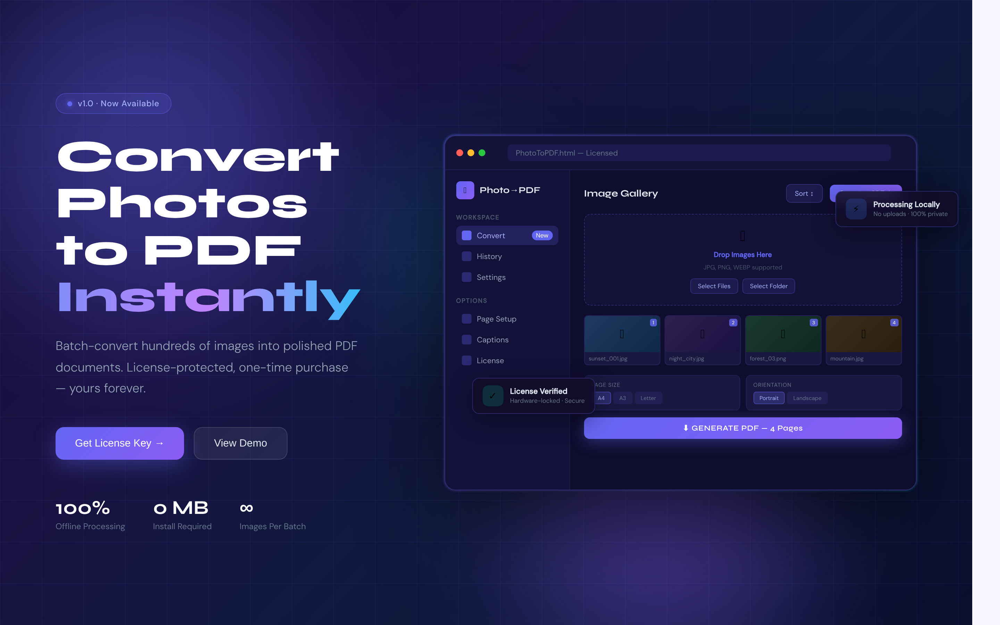
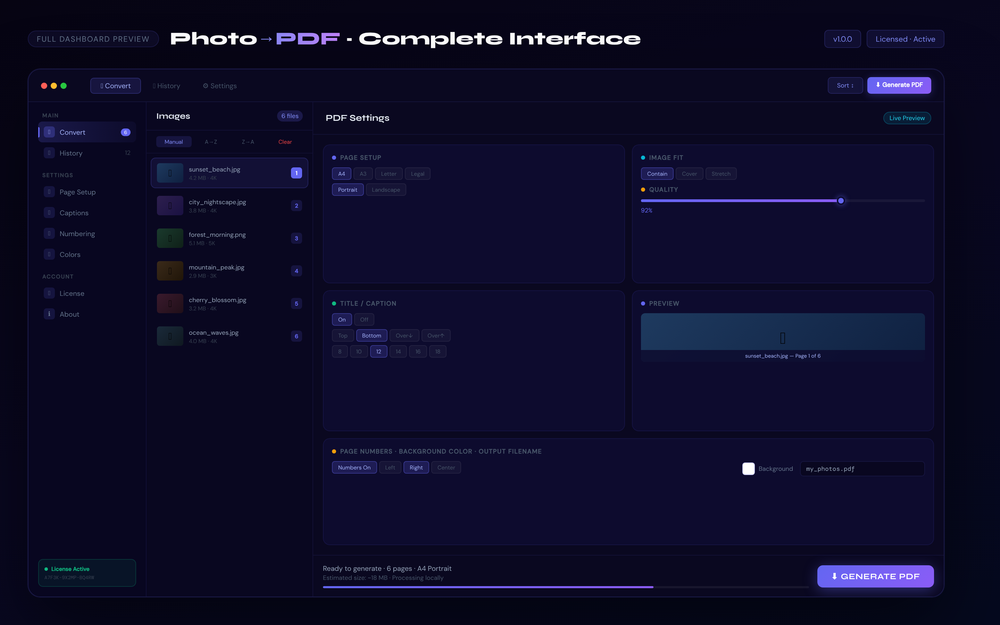
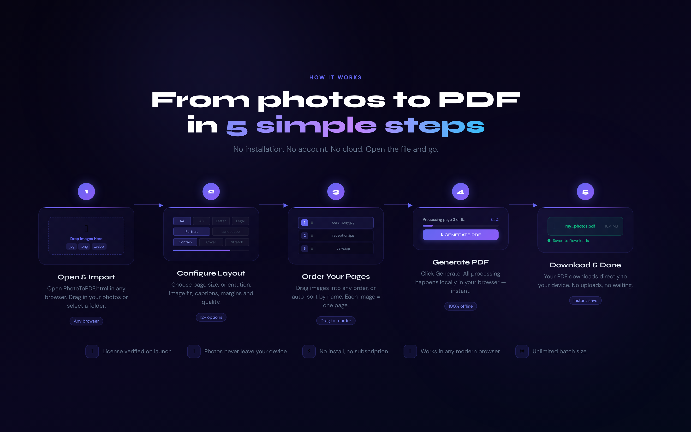
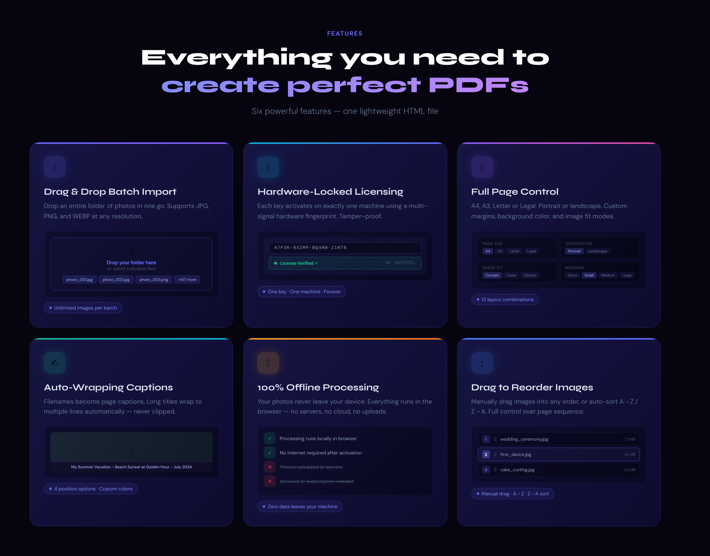

# 📄 Photo → PDF Converter
<p align="center">
  
</p>

A professional batch photo-to-PDF converter with a hardware-locked license system.

- **Client:** Single HTML file — opens in any browser, no installation
- **Server:** Zero-dependency Node.js — no npm install needed
- **Licensing:** Keys bound permanently to hardware fingerprints
- **Tunnel:** Cloudflare Tunnel for public HTTPS with no admin/firewall access needed




---

## Repository Structure

```
photopdf/
├── client/
│   └── PhotoToPDF.html          ← Distribute this to users
│
├── server/
│   ├── server.js                ← Main license server (zero dependencies)
│   ├── package.json
│   ├── config.example.json      ← Template — copy to config.json
│   ├── start.bat                ← Windows startup script
│   ├── stop.bat                 ← Windows stop script
│   ├── setup.ps1                ← One-click Windows VPS setup (no admin)
│   └── scripts/
│       ├── init.js              ← Generate keys + config on first run
│       └── admin.js             ← CLI admin tool
│
├── docs/
│   ├── SETUP_LINUX.md
│   ├── SETUP_WINDOWS.md
│   └── SETUP_WINDOWS_NO_ADMIN.md
│
├── .gitignore
└── README.md                    ← You are here
```

> ⚠️ `config.json`, `license_db.json`, and `LICENSE_KEYS.txt` are in `.gitignore` and will never be committed. They are generated locally by `init.js`.

---

## Quick Start

### 1 — Clone the repo

```bash
git clone https://github.com/yourusername/photopdf.git
cd photopdf/server
```

### 2 — Generate config and license keys

```bash
node scripts/init.js
```

This creates:
- `config.json` — server settings and admin secret
- `license_db.json` — database of 50 keys + 100 device slots
- `LICENSE_KEYS.txt` — your master key list **(keep this private)**

### 3 — Start the server

```bash
node server.js
```

### 4 — Configure the client

Open `client/PhotoToPDF.html` in a text editor and set your server URL:

```javascript
const SERVER_URL = 'https://your-tunnel-or-domain.com';
```

### 5 — Distribute

Share `client/PhotoToPDF.html` with your users along with their license key.

---

## Server API

| Method | Endpoint | Auth | Description |
|--------|----------|------|-------------|
| `POST` | `/api/activate` | None | Activate a key on a device |
| `POST` | `/api/verify` | None | Verify a stored session token |
| `GET` | `/api/health` | None | Health check |
| `GET` | `/api/admin/status` | Admin secret | View all key states |
| `POST` | `/api/admin/revoke` | Admin secret | Reset a key |

### Activate a key

```bash
curl -X POST https://your-server.com/api/activate \
  -H "Content-Type: application/json" \
  -d '{"key":"XXXXX-XXXXX-XXXXX-XXXXX","fingerprint":"HARDWARE_HASH"}'
```

### Admin: View all keys

```bash
curl https://your-server.com/api/admin/status \
  -H "X-Admin-Secret: your_admin_secret"
```

### Admin: Revoke a key

```bash
curl -X POST https://your-server.com/api/admin/revoke \
  -H "Content-Type: application/json" \
  -H "X-Admin-Secret: your_admin_secret" \
  -d '{"key":"XXXXX-XXXXX-XXXXX-XXXXX"}'
```

---

## Admin CLI

A local command-line tool for managing keys without hitting the HTTP API.

```bash
# Show summary
node scripts/admin.js status

# Show all activated keys
node scripts/admin.js list-used

# Show all unused keys
node scripts/admin.js list-free

# Revoke a specific key
node scripts/admin.js revoke --key=XXXXX-XXXXX-XXXXX-XXXXX

# Inspect a specific key
node scripts/admin.js inspect --key=XXXXX-XXXXX-XXXXX-XXXXX

# Backup the database
node scripts/admin.js backup

# Generate 10 additional license keys
node scripts/admin.js generate --licenses=10
```

---

## License Key Types

### License Keys (`XXXXX-XXXXX-XXXXX-XXXXX`)
- One-time use
- Consumed on first activation
- Permanently bound to that machine's hardware fingerprint
- If user gets a new computer: revoke the key via admin, reissue

### Device Slots (`DEVxxx-XXXXX-XXXXX-XXXXX`)
- For machines you manage directly (office PCs, kiosks)
- Binds to first machine that activates it
- 100 slots generated by default (DEV001 through DEV100)

---

## Hardware Fingerprint

The client builds a fingerprint from multiple browser signals that are hardware-specific and cannot be changed without significant effort:

- Canvas rendering (GPU/font rendering — unique per machine)
- WebGL renderer and vendor strings
- Screen resolution and pixel density
- System timezone and language
- CPU core count and device memory
- Audio API processing signature
- Installed font set detection

All signals are hashed together with SHA-256 to produce a single stable identifier. Clearing browser storage does **not** change the fingerprint.

---

## Windows VPS Deployment (No Admin Required)

The included `setup.ps1` script automates the entire setup on a Windows VPS with limited access:

```powershell
Set-ExecutionPolicy Bypass -Scope Process -Force
.\setup.ps1
```

This will:
1. Create `%USERPROFILE%\photopdf-app\`
2. Download Node.js portable (no installer)
3. Download cloudflared portable (no installer)
4. Copy server files into place
5. Run `init.js` to generate keys and config
6. Register a Task Scheduler entry (user-level, no admin)
7. Start everything immediately

After running, find your public Cloudflare URL:

```powershell
Get-Content "$env:USERPROFILE\photopdf-app\logs\tunnel.log" -Tail 20
```

---

## Environment Variables

| Variable | Default | Description |
|----------|---------|-------------|
| `PORT` | `3000` | Server listening port |
| `ADMIN_SECRET` | from `config.json` | Override admin secret |

---

## Generating More Keys

```bash
# Add 25 more license keys to the existing database
node scripts/init.js --licenses=25 --devices=0 --force

# Or use the admin CLI (appends without overwriting)
node scripts/admin.js generate --licenses=25
```

---

## Backup

Always back up `license_db.json` regularly — it contains all activation records.

```bash
# Via CLI
node scripts/admin.js backup

# Manually
cp license_db.json license_db_backup_$(date +%Y%m%d).json
```

---

## Security Notes

- `config.json`, `license_db.json`, and `LICENSE_KEYS.txt` are in `.gitignore` — they will never be pushed to GitHub
- Change `allowedOrigin` in `config.json` from `*` to your specific domain in production
- Use HTTPS in production (Cloudflare Tunnel provides this automatically)
- Back up `license_db.json` regularly — losing it means losing all activation records
- The admin secret is only ever sent over HTTPS and only from your own admin commands

---

## App Features

| Feature | Details |



|---------|---------|
| Page sizes | A4, A3, Letter, Legal |
| Orientation | Portrait, Landscape |
| Image fit | Contain, Cover, Stretch |
| Margins | None, Small, Medium, Large |
| Title/caption | Top, Bottom, Overlay Top, Overlay Bottom |
| Title styling | Font size, text color, background bar color |
| Page numbers | On/off, Left/Center/Right position |
| Sort order | Manual drag, A→Z, Z→A |
| Image quality | 50–100% slider |
| Output | Custom PDF filename |
| Processing | 100% client-side — images never leave the browser |
